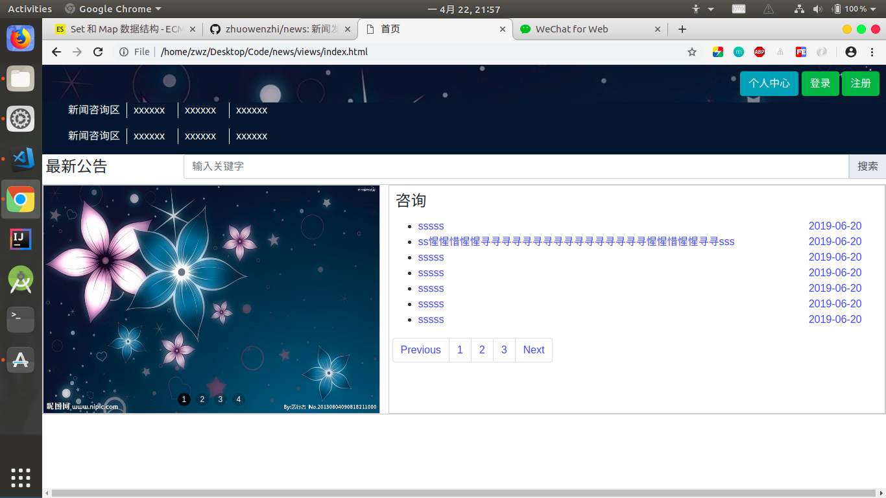
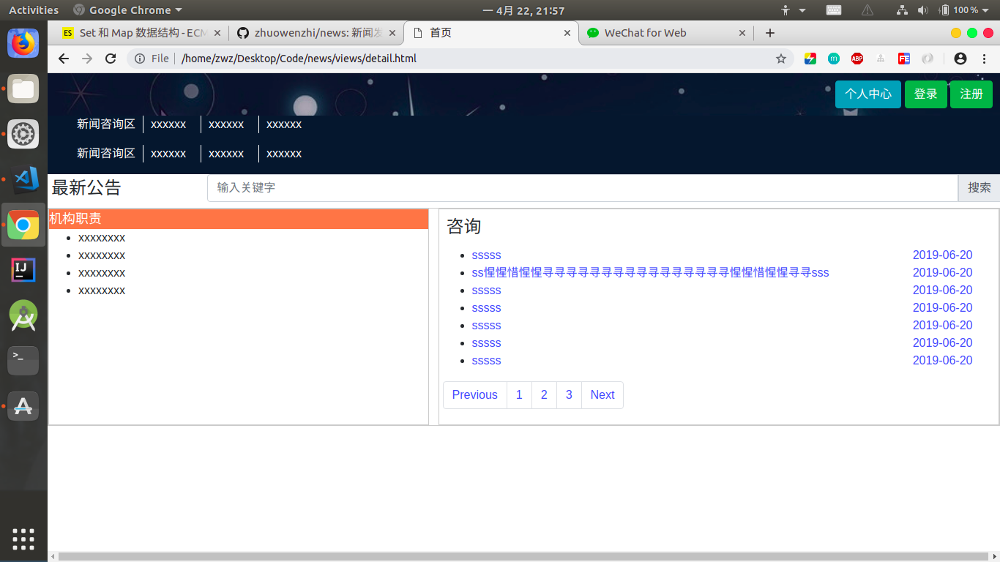
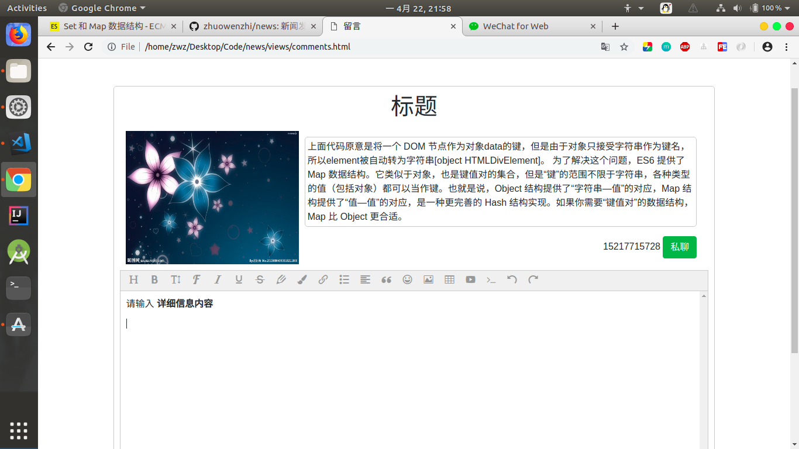
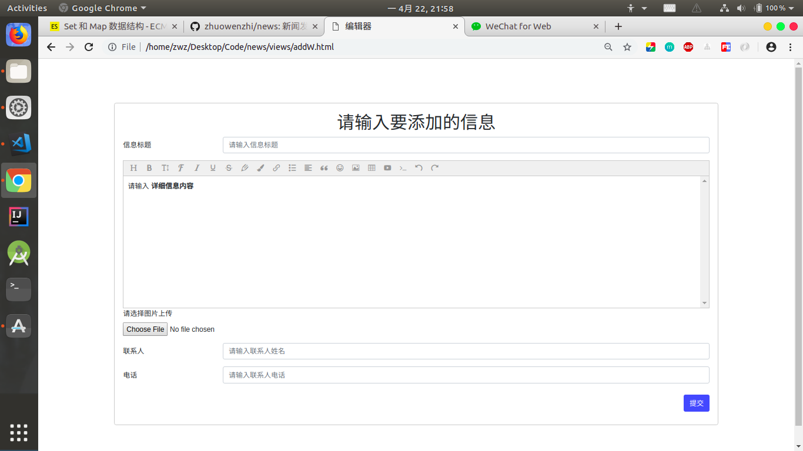

# news

新闻发布系统静态页面

# 首页

# 详情页

# 留言页

# 添加信息页

>参考插件链接

[布局使用bootstrap](https://getbootstrap.com/docs/4.3/layout/overview/)

[轮播他使用swiper例子](https://idangero.us/swiper/demos/)

[编辑器使用插件wangeditor3](https://www.kancloud.cn/wangfupeng/wangeditor3)